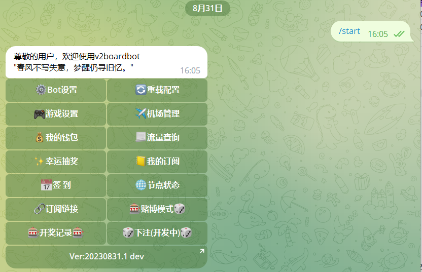
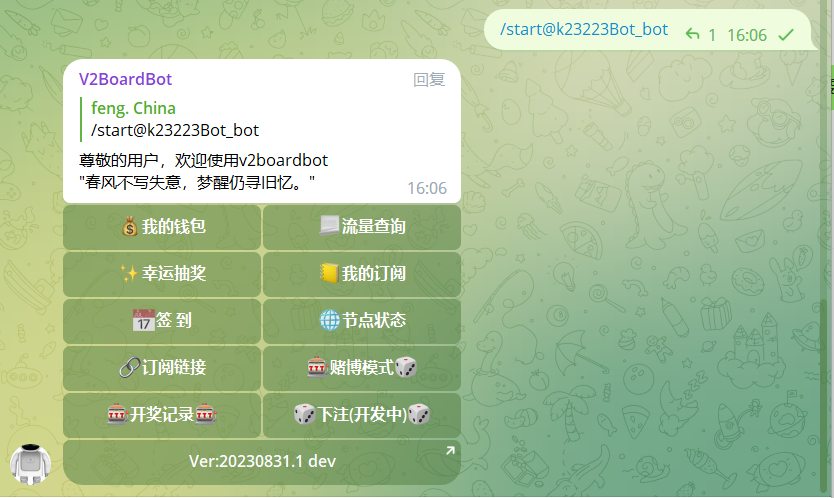
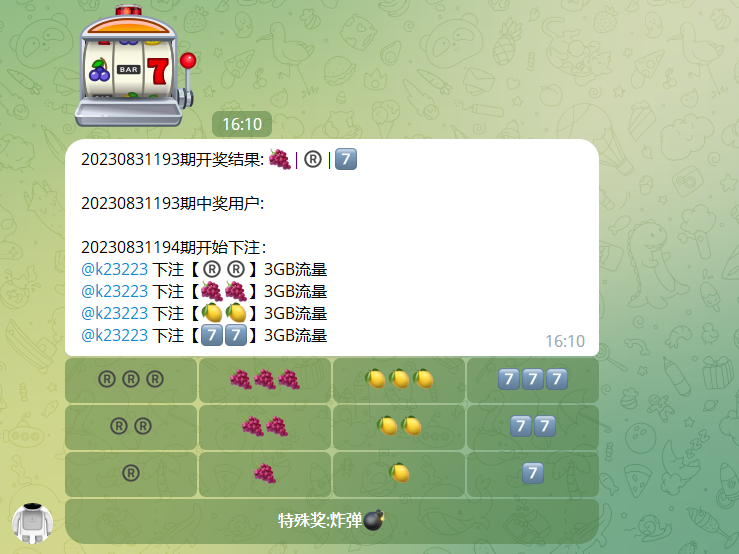

# V2Board Telegram Bot

一个功能丰富的 Telegram 机器人，专为 V2Board 面板用户设计，提供用户账户管理、订阅信息查询、流量统计等功能。通过美观直观的界面，为用户提供极佳的使用体验。

## ✨ 功能特点

### 🔑 用户管理
- 账户绑定/解绑
- 流量查询（美观的进度条展示）
- 钱包余额查询
- 订阅信息查看
- 订阅链接获取

### 🎁 用户福利
- 每日签到获取流量
- 幸运抽奖获取随机流量

### 📊 数据展示
- 节点状态实时查询
- 美观的流量统计图表
- 详细的订阅信息展示

### 👑 管理功能
- 管理员专属设置面板
- 一键调整系统参数
- 套餐有效期批量管理
- 签到/抽奖参数配置

## 🛠️ 安装步骤

### 前提条件
- Python 3.9+
- V2Board 面板
- Telegram Bot Token

### 安装过程
1. 克隆仓库
```bash
git clone https://github.com/qwer8856/xboardbot.git
cd v2boardbot
```

2. 一键安装
```bash
cd v2boardbot
sh install.sh
```

4. 启动机器人
```bash
/root/xboardbot/python-3.9.7/bin/python3.9 Bot.py  #后台运行
nohup /root/v2boardbot/python-3.9.7/bin/python3.9 Bot.py &  #静默运行
```

## 🖼️ 界面展示

### 💰 钱包信息
```
💰 我的钱包
━━━━━━━━━━━━━━━━
💲 钱包总额: 100.00 元
💵 账户余额: 80.00 元
💹 推广佣金: 20.00 元
━━━━━━━━━━━━━━━━
💡 温馨提示: 推广佣金可以用于购买套餐
```

### 🚥 流量统计
```
🚥 流量使用统计
━━━━━━━━━━━━━━━━
📊 总流量: 100.00 GB
📈 使用情况: ████░░░░░░ 40.5%

📤 上传: 15.00 GB
📥 下载: 25.50 GB
📉 已用: 40.50 GB
📌 剩余: 59.50 GB
━━━━━━━━━━━━━━━━
💡 及时关注您的流量使用情况
```

### 📡 节点状态
```
📡 节点状态概览
━━━━━━━━━━━━━━━━
✅ 总节点数: 15 个
🟢 在线节点: 12 个
🔴 离线节点: 3 个
━━━━━━━━━━━━━━━━
🏣 香港节点 01
┣ 状态: 🟢 在线
┗ 在线: 125 人
...
```

## 🔧 配置选项

### 管理员设置
- `🏷️标题设置`: 设置机器人显示的标题
- `🗑️减少时长`: 批量调整所有用户的订阅时长
- `📅签到设置`: 配置每日签到可获得的流量范围 (格式: 最小值|最大值)
- `✨抽奖设置`: 配置抽奖可获得的流量范围 (格式: 最小值|最大值)

## 🤝 贡献指南
欢迎提交 Issues 和 Pull Requests 帮助改进这个项目。在提交 PR 前，请确保您的代码符合以下规范：
1. 遵循 PEP 8 编码规范
2. 添加必要的注释说明
3. 更新相关文档

## 📝 许可证
本项目采用 MIT 许可证 - 详见 [LICENSE](LICENSE) 文件

## 🙏 致谢
- [Python-Telegram-Bot](https://github.com/python-telegram-bot/python-telegram-bot)
- [V2Board](https://v2board.com)
- 所有贡献者们

---

Made with ❤️ for V2Board Users

## 许可证

<p align="center">
<a rel="license" href="http://creativecommons.org/licenses/by-nc-sa/4.0/"></a><br /><span xmlns:dct="http://purl.org/dc/terms/" property="dct:title">v2boardbot</span> 由 <a xmlns:cc="http://creativecommons.org/ns#" href="https://github.com/v2boardbot/v2boardbot" property="cc:attributionName" rel="cc:attributionURL">v2boardbot</a> 采用 <a rel="license" href="http://creativecommons.org/licenses/by-nc-sa/4.0/">知识共享 署名-非商业性使用-相同方式共享 4.0 国际 许可协议</a>进行许可。<br />基于<a xmlns:dct="http://purl.org/dc/terms/" href="https://github.com/v2boardbot/v2boardbot" rel="dct:source">https://github.com/v2boardbot/v2boardbot</a>上的作品创作。
</p>


## 声明: 本程序仅为个人学习使用，切勿用于商业用途


## 联系我们

​		**如果有定制需求可联系个人电报，包括但不限于：数据采集、数据分析、数据标注、数据可视化、网站开发、公司官网建设、微信小程序开发、机器学习、深度学习、量化交易、毕业论文指导。**

邮箱地址：[zhuli8@protonmail.com](zhuli8@protonmail.com)

电报群组：[V2BoardBot](https://t.me/+LxVTX8H1Ca1mNDY1)

测试机器人：[@v2boarddevbot](https://t.me/v2boarddevbot)

个人电报：[@zhuli_8](https://t.me/zhuli_8)


## 食用

#### 机器人创建

请自行 [@BotFather](https://t.me/BotFather) 创建机器人

#### 机器人群组隐私设置

找[@BotFather](https://t.me/BotFather) 发送`/mybots` > 你的机器人 > Bot Settings > Group Privacy > Turn off

如果是Turn on就是禁用隐私设置了，不需要更改

老虎机等玩法依赖 Group Privacy ，如果 Group Privacy 为Turn off 将无法使用

#### 克隆仓库

在你需要部署的机器上克隆本项目

```bash
git clone https://github.com/v2boardbot/v2boardbot.git
```

#### 一键安装

```bash
cd v2boardbot
sh install.sh
```

安装完成会提示前台运行和后台运行，每次更新或者首次运行先前台运行，没问题以后再后台运行

#### 更新

项目更新以后在你克隆的项目目录里执行`git pull`，如果更新日志中存在本地数据库更新类似的提示，删除本地的bot.db

然后执行`sh install.sh`

#### 高级使用

如果是后台运行想要退出机器人或者重新启动机器人，运行`ps -axu|grep Bot.py`命令，也可通过该命令查看后台运行是否正常

```
[root@mycentos v2boardbot]# ps -axu|grep Bot.py
root      76614  2.9  2.2 264612 41208 pts/2    S    18:38   0:00 /root/v2boardbot/python-3.9.7/bin/python3.9 Bot.py
root      76652  0.0  0.0 112824  1000 pts/2    S+   18:39   0:00 grep --color=auto Bot.py
```

`76614`就是机器人运行的进程ID，可以使用`kill -9 76614`命令杀死机器人进程，`76614`换成你自己的进程ID

#### 防白痴说明

在群内发送 设置为开奖群 可开启老虎机 可单独建一个专门开奖群


## 代码修改

本项目遵循`Attribution-NonCommercial-ShareAlike 4.0 International (CC BY-NC-SA 4.0)`开源协议，在你有修改代码的能力的前提下，可遵循本协议继续开发；所有衍生版本不得修改版权信息(包括但不限于机器人菜单底部的项目链接按钮)，自`20230912.1 main`起生效。


## 运行截图

### 管理端



### 用户端





## TODO

- [ ] 重置流量

## 更新记录

#### 20230924.1 main

🟢修复bug，优化代码

💡增加订阅链接配置 [#13](https://github.com/v2boardbot/v2boardbot/pull/13)

#### 20230912.1 main

🟢修复bug，优化代码

💡新成员加入未绑定机器人操作

#### 20230907.1 main

💡开关老虎机开奖(游戏设置=>老虎机)

💡自动设置命令菜单

💡关键词自动回复

#### 20230902.1 main

🟢修复首次运行没有默认配置导致得各种错误

🟢赌博模式开关显示方式修改为符合人类

🟢修复首次运行机器人token显示未配置得情况

💡新增config.yaml.example默认配置文件

💡新增"设置为开奖群"命令管理员验证

[查看更多](version.md)

## 共同维护

欢迎各位大佬提交pr，感谢为本开源项目做贡献；也感谢各位用户，让我有了继续开发得动力

可以提交issues给本项目提供建议，提交issues请把问题和建议讲清楚，感谢各位点击[stars](https://github.com/v2boardbot/v2boardbot/stargazers)

## 鸣谢
- 基于Python的Telegram机器人框架[python-telegram-bot](https://github.com/python-telegram-bot/python-telegram-bot)
- 流量下注玩法参考[cbot_for_v2board](https://github.com/caoyyds/cbot_for_v2board)(已删除仓库)

## 支持开发

**捐赠地址：**`TEqCzhQ48X8iJGYtordwbsd1HXBVYiX9Nr`

仅支持 Tron 资产(TRC10/TRC20)
